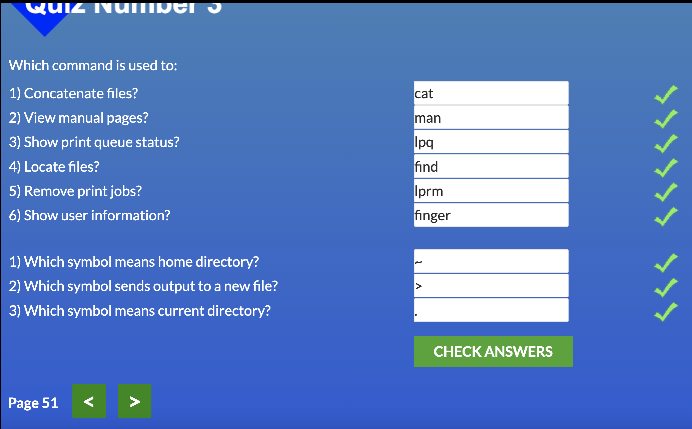

# Git та GitHub
---
- [x] Ознайомився з терміналом: 
 - початок був важкий бо я взагалі не відстрілював як .він працює.
 - зрозумів принципи роботи і перейшов до команд Гіт.
- засвоїв базові команди для контролю версій.
---

#Git для командної співпраці

- [x] Поглибив знання функціоналу Git
- ознайомився з роботою з віддаленими репозиторіями.
- виконав базові операції зазначені в завданні.
- пройшов курс на udacity + гру learn Git branching.

## Udacity screenshot 

## Learn Git Branching

# Linux, Command Line, HTTP Tools
---

- [x] Linux survival 4 modules

- [x] HTTP (part 1,2)
- Досить важкий матеріал для засвоєння, зважаючи на те що я ще ніколи не стикався з даною темою на практиці.
- Прийшло розуміння як саме відбувається комунікація між ПК та сервером і трохи розвінчався магічний ореол навколо "пам"яті" сайтів.
- цікава була частина про оптимізацію використання трафіку шляхом внесення змін до контенту комунікації.
### Загалом для мене це була(і залишиться) дуже цікава тема, адже, на мою думку, використання АПІ різних ресурсів є величезним потенціалом в інформаційному суспільстві, також важливо розуміти цю взаємодію навіть для фронтендера щоб оптимізувати свою роботу.